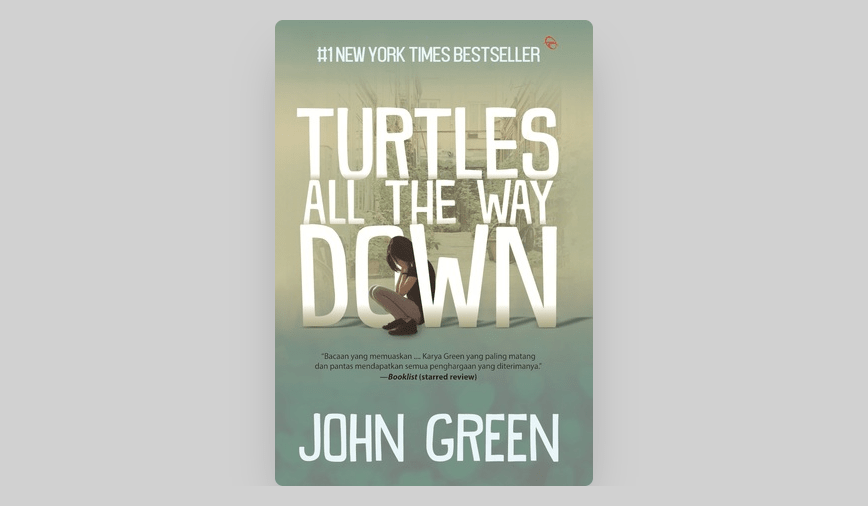

> TLDR: Recommended. 4/5 stars.

Setelah sukses besar dengan novel _The Fault in Our Stars_, John Green kembali menerbitkan novel baru berjudul Turtles All The Way Down. Buku ini mungkin termasuk salah satu buku yang sulit untuk disukai oleh sebagian orang.

Aza Holmes, tokoh utama dalam cerita ini merupakan seorang pengidap OCD (_Obsessive compulsive disorder_). OCD merupakan kelainan psikologis yang menyebabkan seseorang memiliki pikiran, dorongan, dan perilaku yang terus berlanjut meski berdampak negatif pada dirinya. Aza selalu terpaku pada satu hal: ia tidak mau ada bakteri _C. diff_ masuk ke dalam tubuhnya, yang menurutnya dapat membuat dirinya sekarat.

Kisah pada novel ini diawali dengan sebuah misteri. Bersama dengan Daisy, sahabatnya yang sedikit tidak jujur, Aza memutuskan untuk mencari seorang miliarder bernama Russel Pickett, yang hilang di bawah tuduhan penipuan dan penyuapan, dengan harapan mengantongi uang hadiah sebesar 100.000 dolar Amerika.

Di awal pencarian mereka, Aza mulai jatuh hati pada Davis, putra dari Russel, yang meskipun mendapatkan hak istimewa yang berlebihan (salah satunya rumah mewah lengkap dengan bioskop), juga bermasalah: masih berduka terhadap kematian ibunya, yang meninggal sembilan tahun lalu, sekarang ia harus berurusan dengan menghilangnya ayahnya, dan fakta bahwa jika ayahnya meninggal, maka seluruh kekayaan ayahnya akan diwariskan pada seekor tuatara, reptil peliharaannya.

Pada banyak bagian awal novel ini di mana rasanya seolah-olah pembaca akan membaca layaknya novel misteri pada umumnya. Mulai dari miliarder eksentrik yang hilang, sungai yang keruh, rumah yang penuh dengan rahasia, jalan setapak dan jalan buntu, dari itu semua seakan-akan pembaca merasa bisa memprediksi bahwa akan ada alur cerita yang besar. Namun setelah membaca novel ini cukup jauh, pembaca akan mendapati bahwa fokus utama Green bukanlah misteri, melainkan persahabatan remaja, cinta, dan mungkin yang terpenting, kesehatan mental Aza.

Seperti di novel-novel Green lainnya, novel ini menggunakan sudut pandang orang pertama dengan narator yang bersifat introvert. Di sini Aza menderita pikiran—yang menurutnya bersifat invasif—yang berpusat di sekitar rasa takut akan bakteri dan infeksi. Tampak dari kebiasaannya yang diceritakan berulang-ulang dalam novel ini, bahwa Aza terus membuka kembali luka di jari untuk “mengeringkannya” dari infeksi—salah satu gejala orang yang mengidap penyakit OCD.

Aza dan Daisy mendiami dunia remaja yang berputar-putar tentang rasa suka terhadap seseorang, obrolan larut malam, hingga fiksi penggemar Star Wars. Dan seperti yang paling diunggulkan dari novel young adult, buku ini memiliki pemahaman yang mendalam tentang apa artinya menjadi remaja.

Meskipun ada tokoh bernama Daisy dan Davis, Green tidak melupakan pengembangan karakternya. Aza memang sudah tampil kuat sebagai seorang tokoh. Malah semakin menonjol karena character building yang dilakukan oleh John Green terhadap Daisy dan Davis cukup bagus. Pembaca bisa saja makin bersimpati dengan keadaan Aza dan masalah yang harus dihadapinya.

Ini bukanlah novel yang sempurna. Misteri dan kisah cinta serta aspek kesehatan mental sering kali terkotak-kotak dan terasa terlalu panjang hingga 20 halaman. Di sini Aza terkadang menjadi narator berulang: ini mungkin cocok untuk seorang yang menderita pikiran repetitif, tetapi dapat membuat frustasi orang yang membaca. Rasanya seolah-olah ide penyakit spiral muncul setidaknya sekali dalam satu bab. Penceritaan narator mengenai penyakit mental yang dideritanya dipenuhi metafora, karena menurutnya, bahasa manusia tidak dapat secara langsung menggambarkan penderitaan manusia. Namun semua ini ditimpa oleh fakta bahwa Green menuliskannya dengan sangat baik.

Singkatnya, novel ini menegaskan Green sebagai penulis kehidupan remaja yang hebat. Green menangkap rasa tidak aman yang biasa dirasakan remaja pada umumnya. Green menggambarkan pada novelnya bahwa ini bukan tentang bagaimana remaja benar-benar berbicara, tetapi justru bagaimana mereka ingin berbicara—yang mungkin lebih penting. Meskipun karakternya bermasalah dan tidak aman, mereka mengartikulasikan diri mereka sendiri dengan kejernihan dan kecerdasan serta kesadaran diri yang apa adanya.

---

### Related Links

- [Goodreads Page](https://www.goodreads.com/book/show/39800802-turtles-all-the-way-down)
